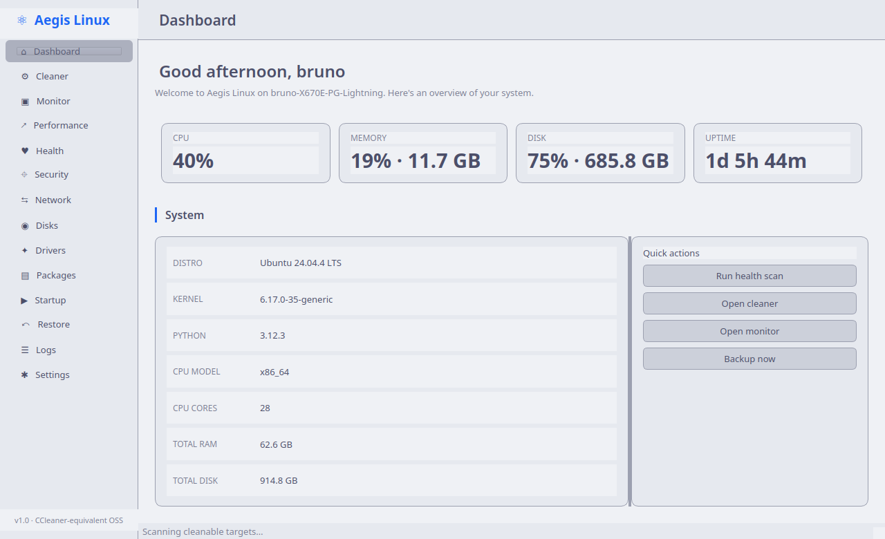
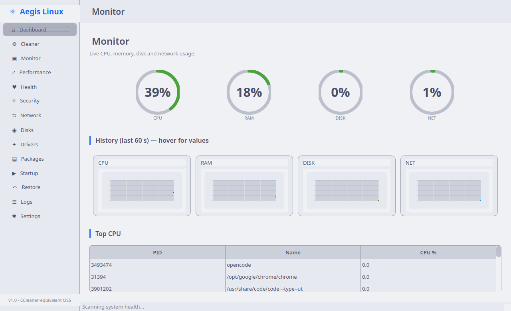
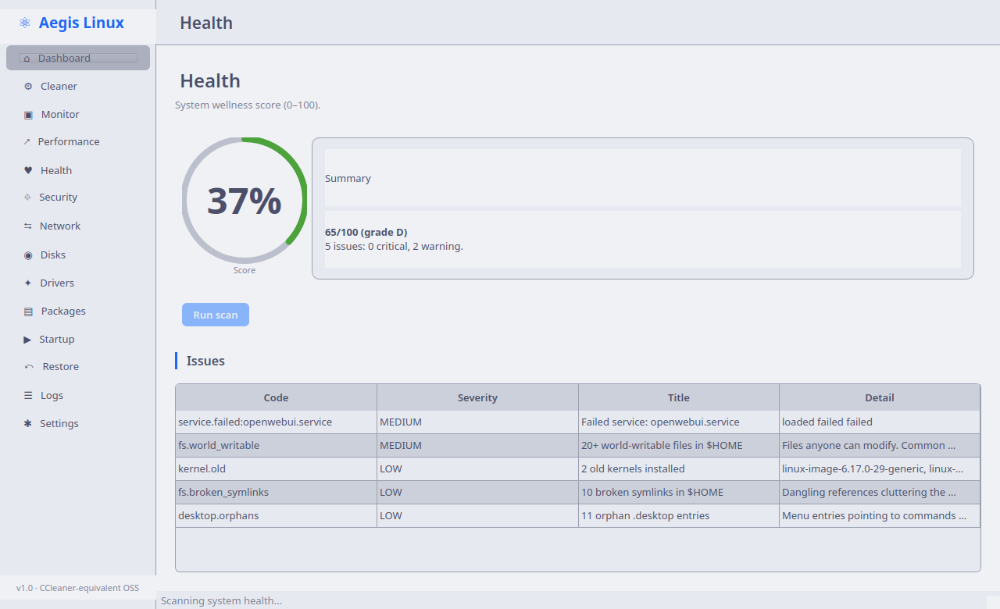
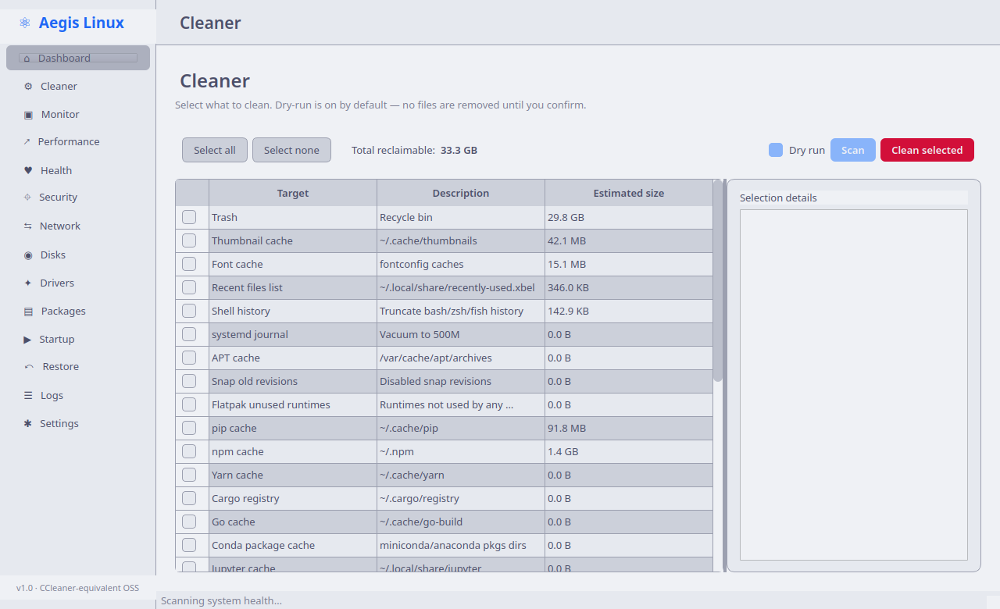

# Aegis Linux

> The Open Source Linux Performance & Security Suite

[](LICENSE)
[](pyproject.toml)
[](#)
[](#)
[](#)

Aegis Linux is a modern, open-source system optimization, monitoring,
maintenance and security suite designed specifically for Linux.

It combines the best ideas from CCleaner, BleachBit, Glances, Stacer,
btop and Microsoft Sysinternals into one coherent application.

---

## Screenshots

| Dashboard | Monitor |
|-----------|---------|
|  |  |

| Health | Cleaner |
|--------|---------|
|  |  |

---

## Why Aegis?

| Concern | CCleaner (Win) | Stacer / BleachBit | btop | **Aegis Linux** |
|---------|----------------|--------------------|------|------------------|
| Cleaner | ✓ | ✓ | ✗ | **✓ (29 targets)** |
| Live monitor | ✗ | basic | ✓ | **✓ (PyQt6-Charts)** |
| Health score | ✗ | ✗ | ✗ | **✓ (0-100 + grade)** |
| Security audit | ✗ | ✗ | ✗ | **✓ (16 findings)** |
| Driver list | ✗ | ✗ | ✗ | **✓** |
| Cleaner backup | ✗ | ✗ | ✗ | **✓ (reversible)** |
| Restore point | limited | ✗ | ✗ | **✓** |
| JSON CLI for scripts | ✗ | ✗ | ✗ | **✓ (`aegis scan`)** |
| Cross-distro portable | ✗ | ✗ | ✗ | **✓ (AppImage)** |
| Local-only, no telemetry | ✗ | varies | ✓ | **✓ (opt-in only)** |
| Open source | ✗ | ✓ | ✓ | **✓ (MIT)** |

---

## Install

### AppImage (no install, drag-and-drop)

```bash
# from the releases page:
wget https://github.com/halgorn/Aegis-Linux/releases/download/v1.0.0/Aegis-Linux-1.0.0-x86_64.AppImage
chmod +x Aegis-Linux-*.AppImage
./Aegis-Linux-*.AppImage
```

### Debian / Ubuntu (.deb)

```bash
wget https://github.com/halgorn/Aegis-Linux/releases/download/v1.0.0/aegis_1.0.0_amd64.deb
sudo dpkg -i aegis_1.0.0_amd64.deb
sudo apt install -f      # resolve dependencies
aegis                     # launch the GUI
aegis scan health        # or use the CLI
```

### From source (dev mode)

```bash
git clone https://github.com/halgorn/Aegis-Linux.git
cd Aegis-Linux
python3 -m venv .venv && source .venv/bin/activate
pip install -e ".[dev]"
python -m aegis          # launch the GUI
python -m aegis scan health
```

---

## CLI

```bash
aegis                                # launch the GUI
aegis --doctor                       # one-shot health report (text)
aegis scan health                    # JSON output
aegis scan disks | jq '.filesystems | length'
aegis scan network
aegis scan performance
aegis scan logs --lines 500
aegis scan cleaner --target pip_cache --target npm_cache
aegis scan cleaner --no-dry-run --target /tmp/large_dir
```

`aegis scan --help` lists all 10 scanners.

---

## Features

* **14 pages** — Dashboard, Cleaner, Monitor (live), Performance, Health, Security,
  Network, Disks, Drivers, Packages, Startup, Restore, Logs, Settings.
* **Simple mode** — Hides 11 advanced pages, shows only Dashboard / Cleaner /
  Health. Toggleable from Settings, perfect for non-technical users.
* **First-run wizard** — Picks language, theme, mode, and telemetry opt-in.
  No restart needed.
* **i18n** — English + Brazilian Portuguese. No gettext / .po toolchain.
* **Cleaner** — 29 targets (browser caches, package managers, system logs,
  thumbnail caches). Bounded walk so a 42 GB trash directory doesn't freeze
  the UI. Dry-run by default. Creates a backup before any real delete.
* **Monitor** — GPU-accelerated PyQt6-Charts line series for CPU/RAM/Disk/Net.
  Live toasts when RAM ≥ 85%, Disk ≥ 90%, Swap ≥ 50%, or GPU temp ≥ 80°C.
* **Health** — 0-100 wellness score with grade (A+…F) and a list of issues
  sorted by severity (failed services, world-writable files, old kernels,
  SSH key permissions, swap pressure, etc.).
* **Security** — Listeners, world-writable files, open relays, antivirus
  presence, SSH hardening.
* **Restore** — Every Cleaner run creates a backup; restore from any point.
* **Config** — Atomic JSON writes (no corruption on crash), XDG-compliant
  location, no root required for read paths.

---

## Architecture

Aegis follows **Clean Architecture / Hexagonal** principles:

```
src/aegis/
├── core/         cross-cutting infra (config, logging, concurrency, i18n, scanners)
├── domain/       pure business models (no I/O, no UI)
├── collectors/   I/O adapters (read /proc, /sys, subprocess, files)
├── services/     use cases (orchestrate collectors + rules)
├── rules/        declarative detection thresholds
├── ui/pages/qt/  one file per Qt page (each ≤ 500 LOC)
└── ui/widgets/   reusable Qt widgets (gauge, scan button, sparkline, ...)
```

Rules of the road:

* ≤ 500 LOC per file
* No circular imports (UI imports services; services never import UI)
* Thread-safe: scans run in `TaskRunner` workers, GUI updates go through `WorkerBridge`
* KISS/YAGNI: no premature abstraction, no factory-for-one-product

See [docs/architecture.md](docs/architecture.md) for the full design.

---

## Development

```bash
# Install dev deps
pip install -e ".[dev]"

# Run tests
pytest -q                          # unit + GUI integration (91 tests)

# Lint
ruff check src tests
black --check src tests

# Build a .deb locally
./packaging/deb/build.sh

# Build an AppImage locally (needs appimagetool)
./packaging/appimage/build.sh
```

### Adding a scanner

1. Add an adapter in `src/aegis/core/scanners.py`:

   ```python
   def _adapter_mything(args):
       from mypackage import thing
       return thing.scan()

   SCANNERS["mything"] = (_adapter_mything, "MyThing - description")
   ```

2. Add the new scanner to the appropriate page in `src/aegis/ui/pages/qt/`.

The CLI picks it up automatically — `aegis scan mything` just works.

### Adding a translation

1. Edit `src/aegis/core/i18n.py` and add `MESSAGES_<code>` with the new keys.
2. Add the code to `_LOCALES`.
3. Add the human label to `available_locales()`.

No `.po` files, no Qt Linguist.

---

## License

MIT. See [LICENSE](LICENSE).

## Contributing

PRs welcome. Run `pytest -q` before pushing — 91 tests must pass.